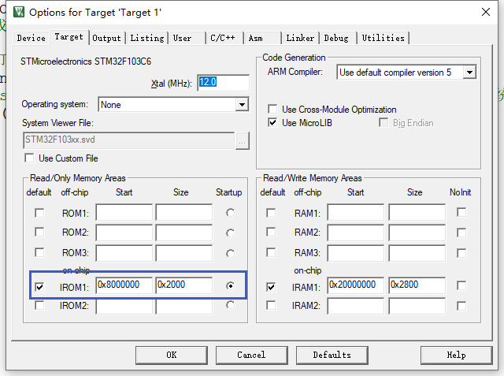
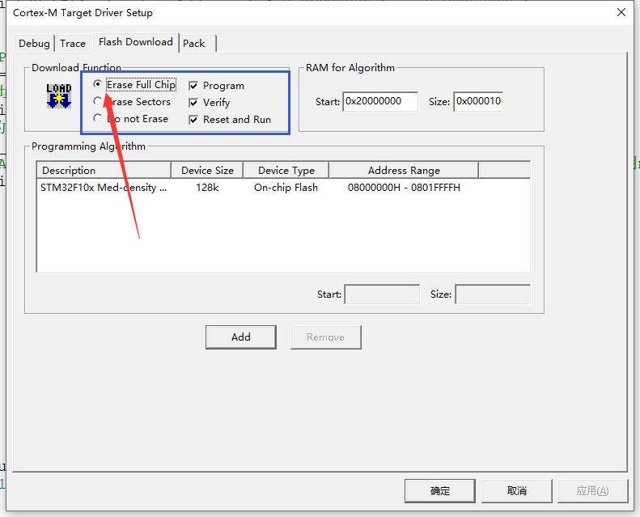
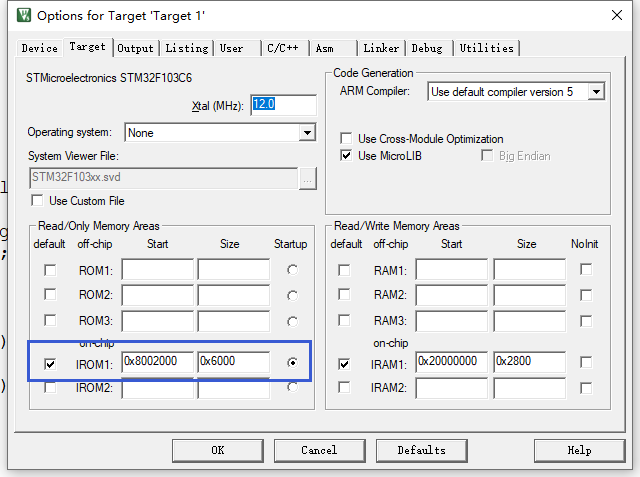
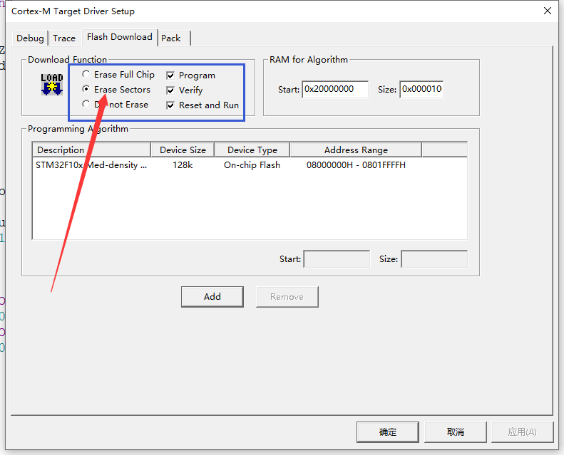

## 代码

这部分说明的代码对应 ，直接按照工程说明下载就能看到效果了

../BOOT/01_BootBasic

../APP/01_AppBasic

## BOOT 工程说明

1、设置下载程序的区间



2、下载时选择擦除全部Flash，也可以不擦完，选第二个，就是你自己得记住擦了哪些位置。



3、代码说明

其实代码注释已经很清楚了

```c
// 函数指针重定义
typedef  void (*pFunction)(void);
// APP代码的存储地址
#define ApplicationAddress 0x8002000

pFunction Jump_To_Application;
uint32_t  JumpAddress;

int JumpToApplication() 
{
	// 1、判断 APP 首地址中存储的数据是不是 0x2000 开头的，因为内存地址在这里
	// 这个判断是为了确认APP的初始栈顶指针（MSP）是否在SRAM区域内。
    // 在STM32中，SRAM通常从0x20000000开始，大小因芯片而异（如20KB、64KB、128KB等）。
    // 这个掩码0x2FFE0000是为了屏蔽掉低位地址变化，只保留SRAM区域的高位特征。
	if( ( ( *(__IO uint32_t*)ApplicationAddress ) & 0x2FFE0000 ) == 0x20000000 )
	{   
		printf("\r\n Run to app.\r\n");
		// 2、获取APP的复位向量（Reset_Handler）的地址，也就是APP的入口函数地址，
		JumpAddress = *(__IO uint32_t*) (ApplicationAddress + 4);
		// 3、把该地址转化成实际的函数
		Jump_To_Application = (pFunction) JumpAddress;
		// 4、把APP的初始栈顶地址加载到MSP寄存器中。
		__set_MSP(*(__IO uint32_t*) ApplicationAddress);
		// 5、跳转到APP的Reset_Handler，也就是APP的启动代码，之后APP会初始化自己的系统、调用main()。
		Jump_To_Application();
		return 0;
	}
	else
	{
		printf("\r\n Run to app error.\r\n");
		return -1;
	}
}
```

## APP工程说明

1、设置下载程序的区间



2、下载时选择擦除指定区间Flash



3、代码说明

其实主要就是在执行开始的时候，需要把中断向量表的位置偏移到APP所存储的位置

```c
#define ApplicationAddress  0x8002000//应用程序地址

NVIC_SetVectorTable(NVIC_VectTab_FLASH, ApplicationAddress - 0x08000000);
```

