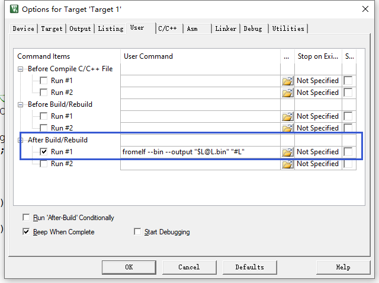
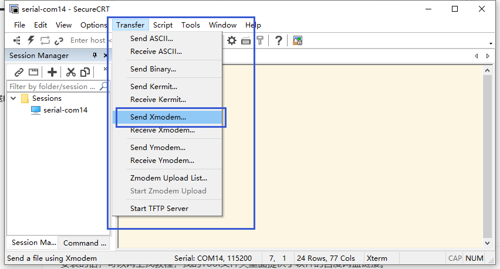

## 代码

这部分说明的代码对应 ，直接按照工程说明下载就能看到效果了

../BOOT/02_BootUpgrade

../APP/01_AppBasic

## BOOT 工程说明

和Basic的代码相比，这个工程多了一个flash擦除的部分，以及一个Xmodem协议接受的部分。

### Flash擦除

为了方便展示目的，就是全部写死，直接就是擦除APP区域，全部擦完。写入的话，就是写入2个字节一次，也就是半字，所以需要转换一下。具体代码可以去看源码相关的注释。

###  Xmodem协议

这个协议的话，简易流程如下

上位机：开启传输，等待下位机发送字符‘C'

下位机：发送’C‘

上位机：发送一帧数据   帧头(1)+包序(1)+包序取反(1)+实际字节（128/1024）+CRC（2）

实际字节需要看帧头，帧头如果是SOH（0x01）就是128字节，帧头如果是STX（0x02)就是1024字节

下位机：根据帧头判断，然后接收一帧数据，并将实际字节写入Flash。并且发送ACK（0x06）

上位机：收到ACK又发送一帧数据

下位机：根据帧头判断，然后接收一帧数据，并将实际字节写入Flash。并且发送ACK（0x06）

.............

上位机：发送数据完成后，发送EOT(0x04)

下位机：发送ACK（0x06）后退出接收

具体处理看代码流程

### main

主函数中，增加了一个检测回车换行的代码，如果检测到回车就会进入升级的相关代码

## APP工程说明

比较重要得是要生成一个bin文件。在User这里加一条指令，这样编译后，就会生成bin文件了。

```bash
fromelf --bin --output "$L@L.bin" "#L"
```



## SecureCRT使用xmodem协议发送Bin文件

安装的话，可以网上找教程，我的Tool文件夹里面提供了软件的百度网盘链接。下面这里就可以选择Xmode协议发送了。


