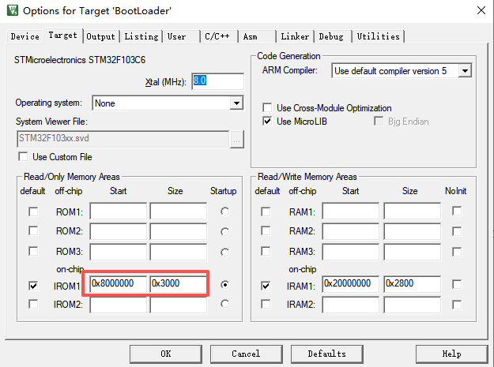
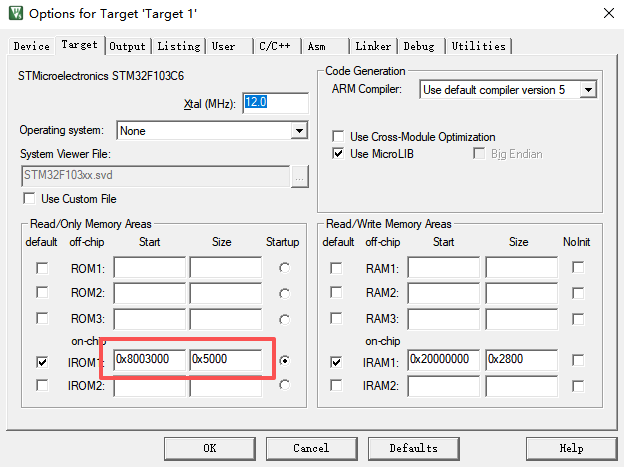
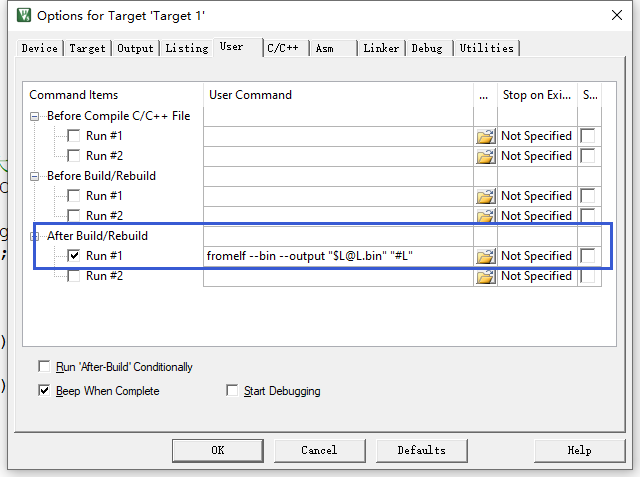
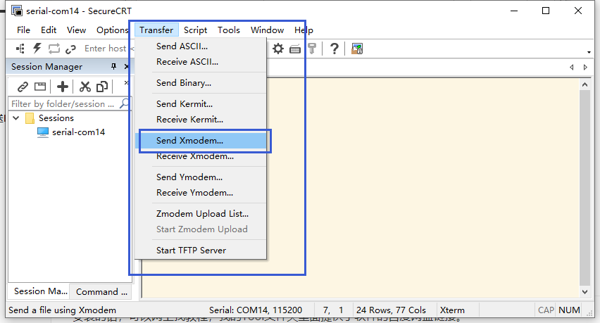
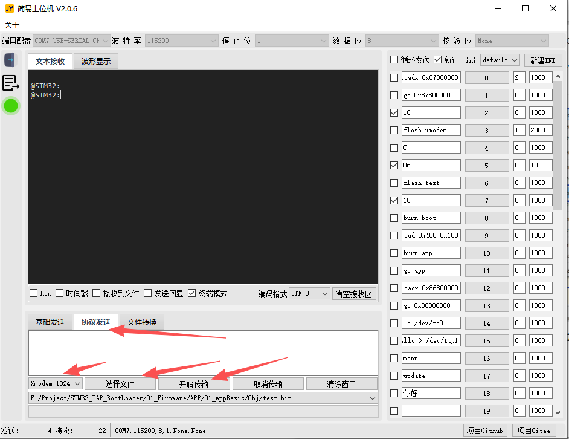

# STM32 IAP 升级 BootLoader学习

> 这个项目是我用来学习关于STM32的IAP的bootloader 相关的代码内容，会不定时的更新这个项目。由于目前接触的不多，所以刚开始的项目内容可能内容不一定正确。使用HAL库进行编程，方便理解。项目仅是原理测试，所以不一定高效。

## ✨ 功能亮点

- 支持 **X/Ymdoem** 协议传输下载 。
- 支持 一个**迷你的命令行**。
- 视频描述（需注意，视频录完后项目是有更新的，以项目内容为准）：
  - https://www.bilibili.com/video/BV1T4hvz6E12    
  - （视频中使用的 APP 起始地址是0x800_2000，后改成0x800_3000，给boot程序多留了0x1000的空间）
  - https://www.bilibili.com/video/BV17BS5BtE65

## 📱联系方式

使用过程中遇到问题，可以添加作者微信，但是作者能力有限，不保证能解答全部问题，但是使用上的问题，可以探讨。

如有疑问，欢迎添加微信号 Qhua_Li7 和作者交流。


## 📂 项目结构

```
STM32_IAP_BootLoader/
├── 00_Reference/          # 一些参考资料
├── 01_Firmware/          # 代码
│   ├── APP/              # 用来测试的应用区代码
│   ├── BOOT/             # 用来测试的BOOT代码
│   │   ├── 01_BootBasic/             # 仅包含一个简易的跳转测试
│   │   ├── 02_BootUpgrade/           # 包含 XModem 升级和跳转
│   │   ├── 03_BootUpgradeCmd/        # 新增 YModem 升级 和 Mini命令行
├── 02_Tools/             # 一些工具  
├── README.md             # 本说明文件  
└── ...                   # 其他 (LICENSE, .gitignore 等)  
```

## ⚙️ 运行环境

- **Keil 版本**：Keil5.29 
- **测试上位机**：建议使用我开源的上位机：
  - github地址：https://github.com/snqx-lqh/JYSWJ
  - gitee地址：https://gitee.com/snqx-lqh/JYSWJ
  - 简易操作视频：https://www.bilibili.com/video/BV17BS5BtE65


### 快速开始

1、区间设计

```C
项目使用的单片机是 STM32F103C6T6 他的Flash是32K 也就是 0x800_0000 - 0x800_8000
我使用 0x0x800_0000 - 0x800_3000 存放 Bootloader
  使用 0x0x800_3000 - 0x800_8000 存放 App 代码
```

2、首先需要给板子下载bootloader程序，打开一个Boot中的程序，比如03_BootUpgradeCmd

设置下载程序的区间，然后下载。



3、打开APP的程序代码，设置下载程序的区间



4、如果你是使用的**第一个Boot程序**。那么APP区域的代码也需要你使用STLink下载进去然后验证启动。因为他只有一个简易的跳转。

5、如果你使用的是**第二个Boot程序**。和Basic的代码相比，这个工程多了一个flash擦除的部分，以及一个Xmodem协议接受的部分。主函数中，增加了一个检测回车换行的代码，如果检测到回车就会进入使用Xmodem下载**bin文件**程序到APP空间。

6、如果你使用的是**第三个Boot程序**。和第二个的代码相比，这个工程多了一个Ymodem接收和命令行处理。也是通过检测回车进入命令行，需要输入命令行才会进入下载，目前支持 `burn app\r\n` 命令为通过Ymodem下载**bin文件**程序到APP空间。

7、第二和第三个Boot工程，我们需要APP工程能够生成生成一个bin文件，然后通过协议下载进单片机。在User这里加一条指令，这样编译后，就会生成bin文件了。

```bash
fromelf --bin --output "$L@L.bin" "#L"
```



8、使用SecureCRT使用xmodem协议发送Bin文件

安装的话，可以网上找教程，我的Tool文件夹里面提供了软件的百度网盘链接。下面这里就可以选择Xmode协议发送了。



9、但是我建议使用我的上位机下载，更加的方便，协议发送，选择对应的协议，选择文件发送即可。



## 🤝 欢迎贡献

欢迎 fork 项目、提交 Issue 。 

## 📄 许可证

本项目使用 **MIT License** 开源。  

## 🙏 致谢

感谢所有使用、测试、反馈和贡献者！
